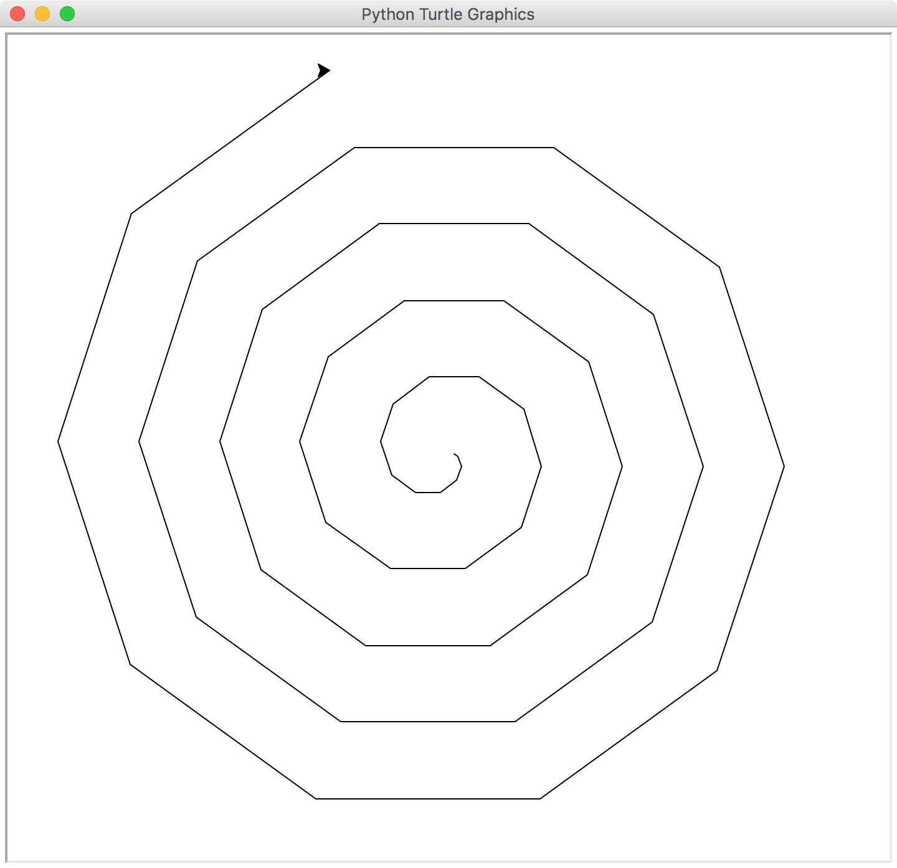
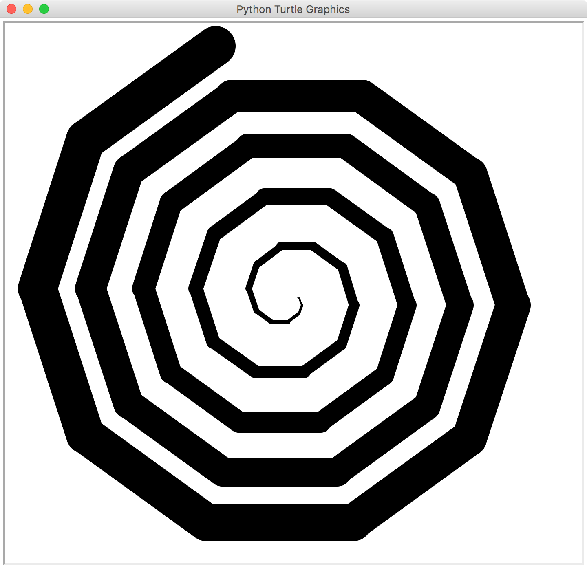
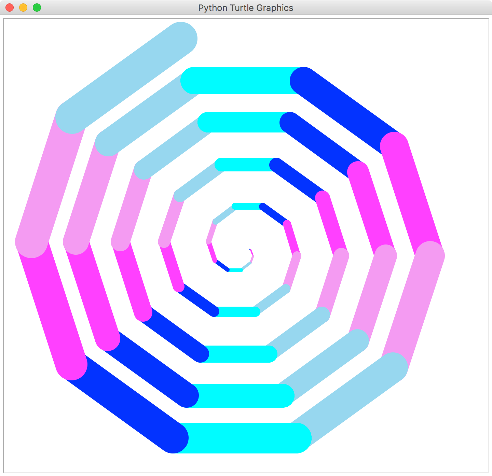

# Create the Basic Spiral
A spiral is made by continuously repeating a turn as if making a circle, but the length of each turn is longer than the last. This can easily be done by creating a loop, and moving the turtle an amount forwards depending on the loop number.

## For Loops
A for loop is used to repeat code a set number of times. The general format is ` for [variable name] in range([start value], [end value], [increment])`. However, sometimes you may not need to specify a start value or increment if you'd like to use the defaults (0 and 1 respectively). 

The code you want to run in the loop is placed in an indented block below it. Each time the you reach the end of the loop, the counter variable is increased, beginning at the start value and stopping right before the end value.

For example, if you wanted to print all the numbers from 1-10, it you could do so with the following loop:
```pyhon
for i in range(10):
  print(i+1)
```
Since `i` starts at 0 and ends at 9, you have to add 1 to `i` before printing it. Alternatively, you could write the loop like this:
```pyhon
for i in range(1,11):
  print(i)
```

## Code
```python
#import turtle module
import turtle

#make the loop that creates the spiral
for i in range(50): #50=num turns, can be any number
  
    #move turtle forwards and turn
    turtle.forward(i*4) #determines space between lines
    turtle.right(36) #360/num of turns
```




# Increasing Width
To add to the spiral effect, we can also make each turn thicker than the last. The width of a line can be increased with `turtle.pensize(size)` or `turtle.width(size)`.

```python
import turtle

for i in range(50):
  
    #increase width each loop
    turtle.pensize(i)
    
    turtle.forward(i*4)
    turtle.right(36)
```




# Increasing Speed
Another thing we can do is increase the speed in which the spiral is drawn. Speed can be any integer from 0-10, with 1 being the lowest, 10 the second highest, and 0 the highest. In this example, the spiral is made in 50 loops, and so by increasing the speed by 1 every 5 loops, we can get a steady increase in speed.

```python
import turtle

#declare rate variable and set speed equal to it
rate = 1
turtle.speed(rate)

for i in range(50):
    
    turtle.pensize(i)
    
    #increase speed every fifth loop
    if i % 5 == 0:
        rate+=1
        turtle.speed(rate)
    
    turtle.forward(i*4)
    turtle.right(36)
```


# Alternate Colours
The last step is to add some colour! Pick a bunch of colours you'd like to use (you can see a list of colour names [here](https://www.tcl.tk/man/tcl8.4/TkCmd/colors.htm)) and put them in a list. You can then alternate between those colours by setting the line colour to the index of that list that is equal to `i % length of list`.

## Lists
Python lists are very similar to arrays in most other languages. Lists hold multiple values, all separated by a comma, placed between square brackets.

For example, a list of subjects would look like this: `subjects = ["english", "art", "math", "science", "history"]`. To access an item in the list, you have to reference its *index*, which is an integer starting at 0. If you wanted to print `art`, you could do so like this: `print(subjects[1]).`

## Code
```python
import turtle

#create an array of colours you'd like to use
colours = ['cyan', 'blue', 'magenta', 'violet', 'skyblue']

rate = 1
turtle.speed(rate)

for i in range(50):
  
    #alternate colours
    turtle.color(colours[i % len(colours)])
    
    turtle.pensize(i)
    
    if i % 5 == 0:
        rate+=1
        turtle.speed(rate)
    
    turtle.forward(i*4)
    turtle.right(36)
```




# Finished Product
Here is the final code, with comments/explanations. Think about what can you change/add to the spiral to make it your own, or make something else entirely using the skills you learned.

```python
#import turtle module
import turtle

#create an array of colours you'd like to use and set the rate
colours = ['cyan', 'blue', 'magenta', 'violet', 'skyblue']
rate = 1

#set speed to rate and hide the turtle shape 
turtle.speed(rate)
turtle.hideturtle()


#make the loop that creates the spiral
for i in range(50):
  
    #alternate colours
    turtle.color(colours[i % len(colours)])
    
    #increase width each loop
    turtle.pensize(i)
    
    #increase speed every fifth loop
    if i % 5 == 0:
        rate+=1
        turtle.speed(rate)
    
    #move turtle forwards and turn
    turtle.forward(i*4)
    turtle.right(36)
```